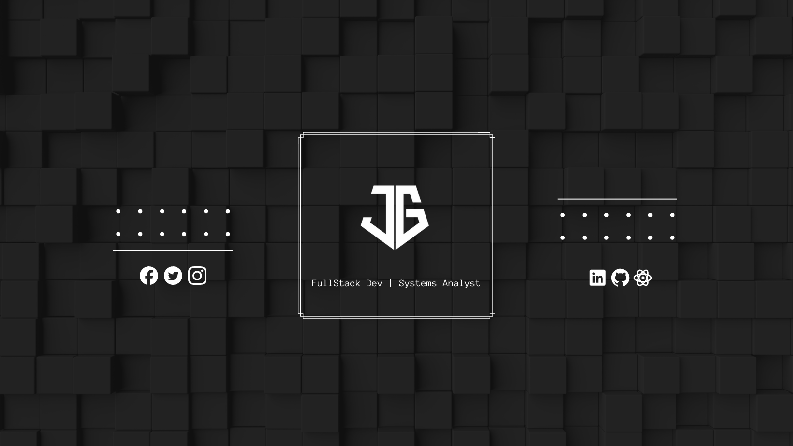

<h1 align="center">Hola 😎👋, I'm Juan </h1>

 Soy un desarrollador full-stack con experiencia en desarrollo de aplicaciones web💻🌍. Me especializo en el uso de tecnologías como Next.js, React , Node.js , Express.js, entre otras tecnologias para el desarrollo de aplicaciones escalables y de alta calidad. También tengo experiencia en implementaciones de bases de datos  Sql y NoSql. Me considero un apasionado del desarrollo, siempre estoy buscando nuevos retos y oportunidades con el fin de aprender y crecer profesionalmente ya que mi objetivo es poder pertenecer a un equipo en el que pueda poner en práctica los conocimientos adquiridos durante mis años de formación. Me gustaría profundizarme dentro de una empresa que ofrezca oportunidades en función de mi desempeño, logros y aportes. 

 

<h1 align="left">📱 Contact</h1>

 <h1 align="left">🛠️ Software/Tools </h1>
 

  
 
 
 
 

 

 
<h1 align="left">💻 Languages/Frameworks </h1>

 

 
 
